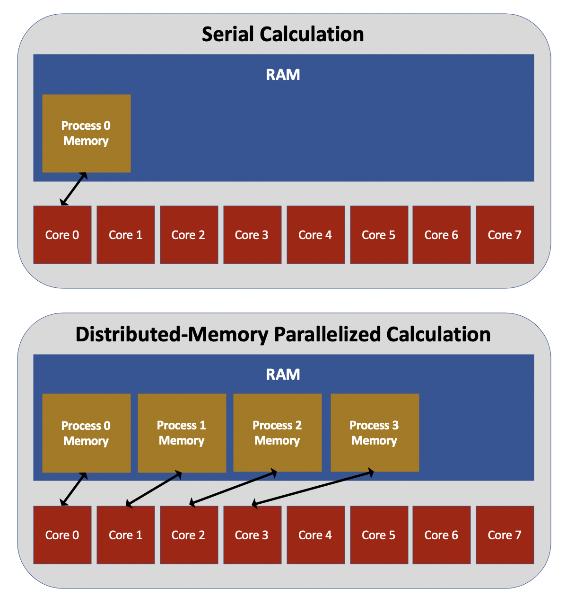

Distributed-memory approaches to parallelization involve running multiple instances of the same executable, with each process being run on a different core.
This is illustrated in the figure below.
Each process has an identification number, known as its *rank*, which is assigned in sequentially increasing order starting from zero.
Other than their rank numbers, each process is an exact duplicate of the others.
If you write a code without any thought to parallelization and then run that code with many processes, each process will simply run the exact same calculation in serial.
In order to benefit from distributed-memory parallelization, you must write additional code that assigns different parts of the calculation to different processes based on their rank.

For example, suppose you write a code that computes the dot product of two vectors, called `a` and `b`.
The figure below shows what this computation might look like in serial: specifically, the code multiples the first element of the two vectors together, then multiplies the second element of the two vectors together and adds this to the previous result, and so on.
In order to parallelize the code, we need different processes to handle the multiplication of different elements of the vectors.
If we run with `nproc` processes and the rank of each process is called `my_rank`, we could have each process multiply and add together only the `my_rank`th, `(my_rank + nproc)`th, `(my_rank + 2*nproc)`th, etc. elements.
This strategy reduces the amount of work each process must do, but it introduces another issue: each process now only has **part** of the total dot product.
Somehow, we also need to perform an operation in which all the processes add together their individual pieces of the dot product.
We won’t get into the details of how to accomplish this operation until the next lesson, but you can already begin to see that two of the key challenges of implementing distributed-memory parallelization are (1) dividing the work of a problem into smaller pieces, and (2) stitching the individual pieces back together into a complete result.

A third major challenge to distributed-memory parallelization is keeping memory usage within acceptable limits.
Because each process allocates its own memory, distributed-memory parallelization tends to store a large amount of redundant information in memory.
For example, many computational chemistry codes store in memory the nuclear coordinates of a group of atoms that comprise the physical system, among other important quantities.
By default, if such a code is run using distributed-memory parallelization, each process will store its own unique copy of all of the nuclear coordinates (although there are ways to modify this behavior).
Intelligently written codes will improve on the default behavior; for example, in the case of the above dot product example, it isn’t necessary for each process to store the entirety of vectors `a` and `b` in memory.
Instead, each process could store only the array elements it needs for its part of the dot product calculation.
Real-world situations are often far more complex, and optimizing the memory usage of a parallel code can easily involve more effort than optimizing its runtime.

The most commonly used approach to distributed-memory parallelization is the [Message Passing Interface (MPI)](https://www.mpi-forum.org/).
In the next section, we will demonstrate how to use MPI to parallelize Python codes.



