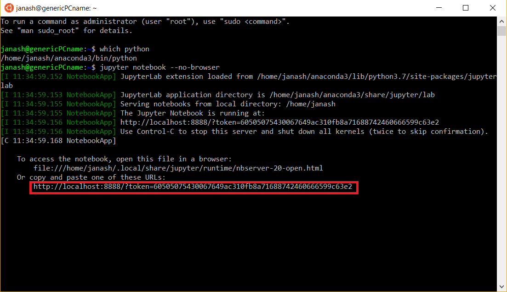

## Anaconda Installation

### Windows

If your computer uses the Windows operating system, we strongly recommend installing Windows Subsystem for Linux (WSL). Follow the installation instructions at [this link](https://docs.microsoft.com/en-us/windows/wsl/install-win10). If you don’t have a preference on Linux distribution, we recommend installing Ubuntu 18.04.

Once WSL is installed, open your ‘Start’ menu and choose ‘Ubuntu’. This should open a terminal window. The first time you have opened Ubuntu, you will see a message which says “Installing, this may take a few minutes…”. After the installation is done, you will have to create a username and password. After these are created, you should be able to use the terminal.

For the WSL, you have to install Anaconda from the command line. Open a terminal, then follow the installation instructions given here. Specifically, the commands you will need are

>wget https://repo.anaconda.com/archive/Anaconda3-2019.03-Linux-x86_64.sh  
>bash Anaconda3-2019.03-Linux-x86_64.sh

After installation, close and reopen your terminal window. If you do not see (base) before your username on the command line, type

>conda init

then close and reopen your terminal window.

Next, check if ‘anaconda3’ is in the path that prints when you type ‘which python’. If not, type the following command into the terminal (change to have your username)

>echo ‘export PATH=/home/YOUR_USERNAME/anaconda3/bin:$PATH’ >> ~/.bashrc

Verify that you have Anaconda installed by opening a Jupyter notebook.

>jupyter notebook --no-browser

Your window should look similar to this after the command. Copy the URL outlined in red, and paste it into a browser.



After verifying your Jupyter notebook works, you will also need to install a compiler. Use this command

>sudo apt install build-essential

The next section tells you how to create a symlink so that you can access your Windows files easily from the WSL.

Make a directory called windows

>mkdir windows

Create a symlink to your Windows files

>ln -s /mnt/c/Users/YOUR_WINDOWS_USERNAME windows

Be careful when working in the WSL, and with your symlink. Do not edit any Windows system files. Any files you delete in the windows folder from the WSL will be deleted on your computer.

If you are not able to install the WSL, please make sure that you at least have the Python 3.7 version of Anaconda for Windows installed.


### Mac OS and Linux

You can download Anaconda and install using [this link](https://www.anaconda.com/products/individual). Make sure to download the correct distribution for your OS and choose the Python 3.7 version. Install the software as you would install any software you downloaded.

Linux users can also install Anaconda using the command line instructions given in the Windows section.

MacOS users should also install [XCode](https://developer.apple.com/xcode/).

Linux users should install compilers using this command

>sudo apt install build-essential


## Creating a Parallel Programming conda environment

Everyone should complete and read this section after installing Anaconda.

To make a great deal of compilation and installation simpler we will create a conda environment. This environment isolates the parallel programming stack from the rest of the dependencies on your laptop.

After installing Anaconda, type the following command into your terminal. This creates an environment called “molssi_pp” which runs Python 3.7.

>conda create -n molssi_pp python=3.7

After creating the environment, activate it using the command

>conda activate molssi_pp

Next, install NumPy, mpi4py, CMake, and OpenMP:

>conda install -c conda-forge numpy mpi4py cmake openmp

## Installing and configuring git

### Installation

Install git in your `molssi_pp` environment using this command.

>conda activate molssi_pp  
>conda install git

### Configuring Git

The first time you use Git on a particular computer, you need to configure some things.

First, you should set your identity. One of the most important things that version control like Git does is to keep track of who changes what. This helps repository maintainers coordinate the efforts of all the people who contribute to the project. Most importantly, it makes it easier to figure out who to blame when something goes wrong. You can provide git your name and contact information with the following commands:

>git config --global user.name "<Firstname> <Lastname>"  
>git config --global user.email "<email address>"

Next, you might want to change the Git text editor. As we will see later, certain Git commands will open text files. When this happens, Git will use your environment’s default text editor, which might not be the editor you are most comfortable using. Using configuration commands, you can tell Git to use your favorite editor.

Everyone can use Vim as a text editor, but you can set it to your preference. **If you are using the WSL, use Vim as your text editor**:

>git config --global core.editor "vim"

A more complete list of possible editors is available [here](http://swcarpentry.github.io/git-novice/02-setup/index.html).

You can check the configuration commands that you have set using:

>git config --list


## Installing Python through Anaconda
[Python](https://python.org/) is a popular language for scientific computing, and great for general-purpose programming as well. Installing all of its scientific packages individually can be a bit difficult, however, so we recommend the all-in-one installer Anaconda.

Regardless of how you choose to install it, *please make sure you install Python version 3.x (e.g., 3.4 is fine, 2.7 is not)*.  Also, please set up your python environment at least a day in advance of the workshop. If you encounter problems with the installation procedure, the instructors will be available 30 minutes before the workshop begins to help you.

## Windows - [Video Tutorial](https://www.youtube.com/watch?v=xxQ0mzZ8UvA)

1. Open the [Anaconda Windows download page](https://www.anaconda.com/download/#windows).
2. Download the installer.  **Be sure you get the Python 3 version.**
3. Double-click the installer icon and follow the setup instructions on screen.  You can use MOST of the default options.  The only exception is to check the **Make Anaconda the default Python** option.

## Mac OS X - [Video Tutorial](https://www.youtube.com/watch?v=TcSAln46u9U)

1. Open the [Anaconda MacOS download page](https://www.anaconda.com/download/#macos).
2. Download the installer. **Be sure you get the Python 3 version.**
3. Double click the installer icon and follow the setup instructions.  You can use all of the default options.

## Obtain lesson materials
1. Put link to download materials here.
2. Create a folder called `cms-workshop` on your Desktop.
3. Move the downloaded materials to the new folder.
4. Unzip the file.  

## Open the Terminal Window
- Windows:  Click Windows Key + R, type cmd, press Enter.
- MacOS: The Terminal application can be found in Applications -> Utilities -> Terminal.

## Start a Jupyter notebook
In the Terminal window, type
```
$ jupyter notebook
```
It may take a few seconds to load the page, especially if it is the first time you have ever used the jupyter notebook, so don't panic if nothing loads for a few seconds.  Then a new window should open in your default internet browser. Use the file navigation window to navigate to the `cms-workshop` folder.  In the upper right hand corner, click New, then choose Python 3 from the dropdown list.  You're ready to go!



